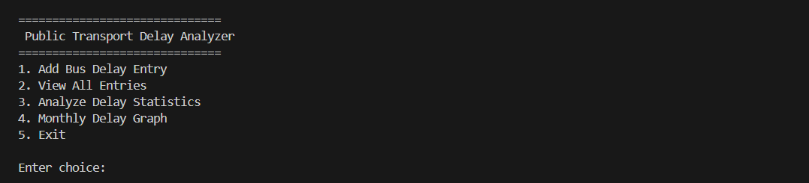
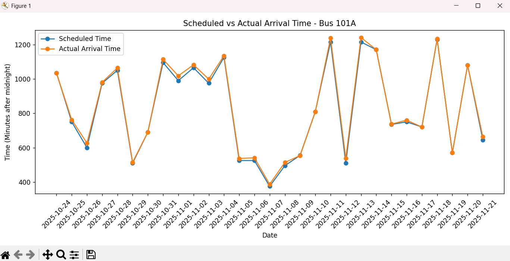

# Public Transport Delay Analyzer

A CLI Python tool to track, analyze, and visualize bus delay data using CSV storage and plots for monthly statistics.

---

## Overview

This application helps users log, review, analyze, and visualize delays in public transportation (bus arrival times).  
Entries are stored in a CSV file, and statistics or monthly trends can be plotted for any bus.

---

## Features

- Add daily bus delay records (with scheduled and actual arrival times).
- View all entries in a formatted table.
- Analyze average, minimum, and maximum delays.
- Count days with zero delays vs. late days.
- Visualize 30-day trends for specific buses using line plots.

---

## Technologies and Tools Used

- **Programming Language:** Python 3.x
- **Libraries:**  
  - `csv` (data storage)  
  - `datetime` (date handling)  
  - `matplotlib` (graphs/plots)  
  - `os` (file/directory operations)
- **CLI:** Standard input/output terminal

---

## Installation Steps

1. **Clone the Repository**

git clone https://github.com/01-Vishwa-R/Vityarthi-project

cd Vityarthi-project

text

2. **Set Up the Environment**

- Ensure Python 3.6 or higher is installed:

  ```
  python3 --version
  ```

- Install matplotlib (if missing):

  ```
  pip install matplotlib
  ```

3. **Directory Structure**

- The script will automatically create a `data/` folder and `delay_log.csv` if not present.

---

## How to Run

python delay_analyzer.py

text

Follow the menu prompts to add, view, analyze, or plot bus delay data.

---

## Instructions for Testing

- To validate your installation:
  1. Start the script and select **Add Bus Delay Entry** (Option 1).
  2. Enter example inputs for all fields.
  3. Use **View All Entries** (Option 2) to confirm your data appears.
  4. Add multiple sample entries for a single bus covering 30+ days to try the graphing feature.
- Optionally, write unit tests for pure functions by separating logic from CLI input if expanding project scope in the future.
- To manually test, repeat the menu operations and verify printed results and graphs appear as expected.

---

## Screenshots

- **Main Menu Example:**  
  
- **Delay Plot Sample:**  
  

---

## License

[MIT License](LICENSE) - Free for educational, personal, or commercial use.

